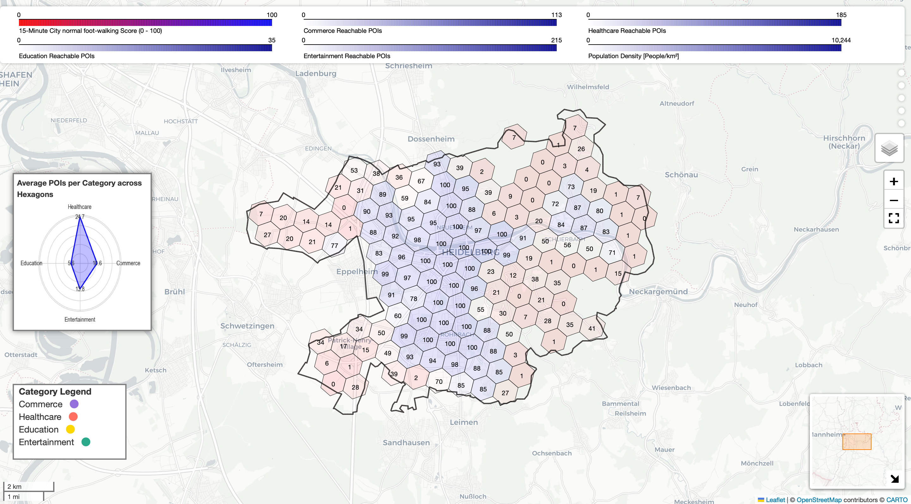

# X-Minute-City Composite Index

Create your own accessibility analysis for your city and needs!

This repository contains the code to create an x-minute city composite index for every German city. The goal of this project is to assess pedestrian acccessibility and walkability in the context of different population group needs in the adaptable framework of the x-minute city. The user can specify the city, the timeframe and the population group (small children, normal, elderly). The results are visualized in an interactive folium dashboard. It can be used for urban planning purposes or individual assessment of cities.

Exemplary result for the city of Heidelberg:

[View the interactive map](https://MilenaLang.github.io/X-Minute-City-Index//img/Heidelberg,%20Germany_foot-walking_15_normal_final.html)
## Relevance 
The 15-minute city concept envisions access to all essential services - including living, working, commerce, healthcare, education and entertainment - within a 15-minute walk or bike ride. As accessibility is not equal throughout a city or across cities, a tool to measure pedestrian accessibility is necessary for urban planners and stakeholders to implement the concept. Existing composite indices often lack timeframe-adaptability and inclusivity by assuming uniform mobility patterns and service needs. Thus, this composite index includes the adaptable timeframe of the x-minute city and three different population groups.  

## Methodology
The script uses open-source OpenStreetmap (OSM) Points of Interest (POIs) for amenities and German Zensus 2022 data for population density. POIs for healthcare, commerce, education and entertainment are fetched via [OSMnx](https://osmnx.readthedocs.io/en/stable/) and cleaned for routing. Small neighborhood units are represented as [h3](https://h3geo.org) hexagonal grid cells of approximately 1km x 1km and filtered to habited areas. Walking time matrices are generated using openrouteservice (ORS) with manual speed adjustments per population group. The time matrices are calculated between POIs and each hexagon's center. The number of reachable POIs per category is scaled to 0-100 by using benchmarks (e.g. 5 healthcare facilities). Different weights are assigned to each category for the three population groups reflecting service priorities. The final index score is the weighted sum of normalized scores across categories. 

## Requirements
To use the jupyter notebook, the following requirements are needed:
- Python 3 with jupyter notebook and the packages listed in `requierements.txt`
  - all libraries can be installed from `requirements.txt`
- [local setup](https://github.com/GIScience/openrouteservice/tree/main?tab=readme-ov-file) of the ORS routing service with docker

## Usage
Usage of the script: 
1. Install all software requirements if necessary
2. Fork the repository
3. Download the Zensus 2022 data from [here](https://heibox.uni-heidelberg.de/d/8c2774bd5b4f4f09b45d/) and copy it into the repository folder
3. Open the x_minute_city_index.ipynb script in a scripting environment
4. Run the script with your input parameters (city, timeframe, walk-speed) and check the results in the .html interactive dashboard

Note: The script  can be adapted to different amenities, priorities and walking speeds. It can also be transfered to other countries by using country-specific osm.pbf files and eurostat/worldpop demographic data.
- to switch category priorities, change the weighting in the code
- to change demographic data, specify another dataset as population data
## Author 
This project is part of a master's thesis in geoinformatics by Milena Bremer.

